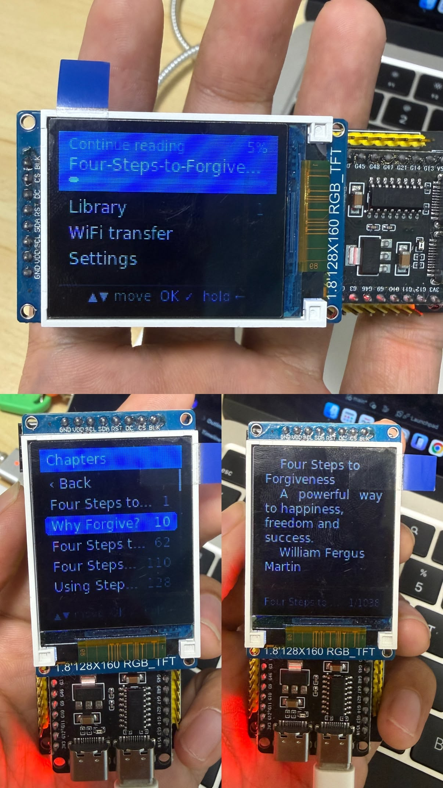
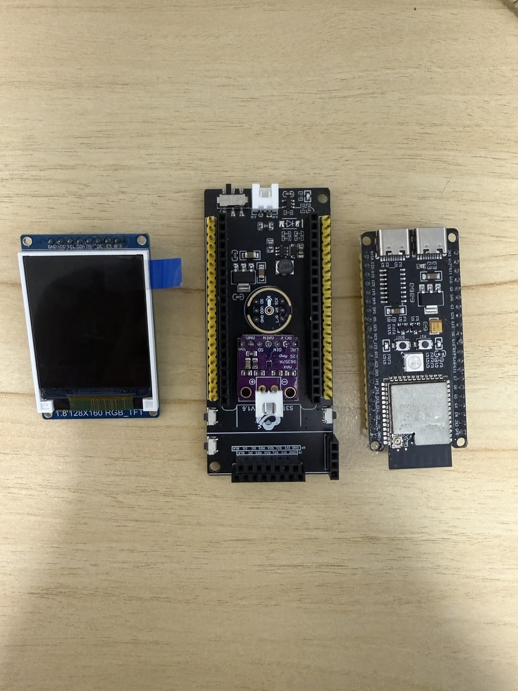

# ESP32-S3 E-Reader



Firmware for an ESP32-S3 e-reader with a small SPI colour TFT (default: **1.8" 128×160 ST7735S**)
and **one or three buttons**. You upload books over **WiFi** from a phone or computer browser.

- Formats: **EPUB**, **TXT**, **Markdown** (headings become chapters)
- Anti-aliased fonts in 8 sizes (10–28 px, Latin + Greek + Cyrillic), justified text, paragraph indent/spacing
- Chapters (from the EPUB table of contents, Markdown headings, or detected in TXT), "Go to %", progress bar, page numbers
- Four themes (Light, Sepia, Dark, Night/amber), brightness, portrait or landscape (Settings → Screen)
- Your position is saved automatically. Sleep with a 3 s hold, wake with a press, and you're back on your page
- Hotspot mode with a QR code to join and a captive portal (the upload page opens by itself on most phones), or join your home WiFi
- Works on every panel preset in menuconfig: 80×160, 128×128, 128×160, 135×240, 170/172×320, 240×240,
  240×280, 240×320, 320×480, or a custom panel. The whole UI scales to the screen size.

---

## 1. Hardware



1. 128x160 RGB TFT Display
2. S3 extender v1.6 board
3. ESP32-S3 board

### Display wiring (SPI TFT → ESP32-S3)

| TFT pin (common names) | ESP32-S3 GPIO (default) | menuconfig option |
|---|---|---|
| GND                    | GND   | |
| VCC                    | 3V3   | |
| SCL / SCK / CLK        | **21** | `SCL / SCK GPIO` |
| SDA / MOSI / DIN       | **47** | `SDA / MOSI GPIO` |
| RES / RST              | **45** | `RES / RST GPIO` (-1 if not wired) |
| DC / A0 / RS           | **40** | `DC / A0 / RS GPIO` |
| CS                     | **41** | `CS GPIO` (-1 if tied to GND) |
| BLK / LED / BL         | **42** | `BLK / LED backlight GPIO` (-1 = always on) |

Any free GPIOs work. Avoid 19/20 (USB), 26–32 (flash), 33–37 on boards with octal PSRAM, and 43/44 (UART log).

### Buttons

| Button | GPIO (default) | menuconfig (E-Reader Configuration → Buttons) |
|---|---|---|
| OK (left, BOOT) | **0**  | `OK / main button GPIO` |
| Up / previous   | **38** | `Up / previous page button GPIO` |
| Down / next     | **39** | `Down / next page button GPIO` |

Each button connects its GPIO to GND when pressed. The internal pull-ups are used, so no resistors are needed.
Set Up and Down to `-1` for **one-button mode**, which uses tap / double tap / hold gestures instead.

- **Settings → Button test** shows the GPIO number of any button you press, so you can find unknown wiring.
- Only GPIO 0–21 can wake the chip from deep sleep. With the defaults, **press OK to wake**.
- Holding GPIO0 while pressing **RESET** starts download mode. That's normal; just release it.

---

## 2. Build and flash (idf.py)

Tested with **ESP-IDF v5.5.3**. IDF v5.1 or newer should work.

### ESP-IDF install

```bash
git clone https://github.com/espressif/esp-idf.git
cd esp-idf && ./install.sh esp32s3
```

After that, activate IDF in every new terminal:

```bash
. ./export.sh
```

### Build

```bash
cd esp32-s3-ereader
```

```bash
idf.py set-target esp32s3
```

```bash
idf.py menuconfig
```

In **E-Reader Configuration**:

1. **Display → Display panel**: choose your panel. The default is 1.8" 128×160 ST7735S.
2. **Display → pins**: match your wiring.
3. **Button**: the GPIO and gesture timing.
4. **WiFi transfer**: hotspot name prefix and password (default password `readbooks`).

Then build, flash and open the serial log. Replace the port with yours (`ls /dev/cu.*`):

```bash
idf.py build
```

```bash
idf.py -p /dev/cu.usbmodem1101 flash monitor
```

Exit the monitor with `Ctrl+]`.

### Flash size: more room for books

The default partition table fits **4 MB** flash, which leaves about 2.2 MB for books. Most ESP32-S3 boards have 8 or 16 MB
(an "N8" or "N16" part). To use it, edit `sdkconfig.defaults`:

```
CONFIG_ESPTOOLPY_FLASHSIZE_8MB=y
CONFIG_PARTITION_TABLE_CUSTOM_FILENAME="partitions_8mb.csv"
```

(`partitions_16mb.csv` is also included.) Then rebuild from scratch:

```bash
idf.py fullclean
```

```bash
rm sdkconfig && idf.py build
```

Flashing a new partition table formats the book storage.

---

## 3. Using the reader

### Controls

| | 3 buttons (default) | 1 button |
|---|---|---|
| Next page / item | **Down** (hold to repeat) | tap |
| Previous page / item | **Up** (hold to repeat) | double tap |
| Select / open book menu | **OK** | hold until the top bar appears, then release |
| Back | hold **OK**, release when the top bar appears | "‹ Back" item |
| Sleep | hold **OK** 3 s | hold 3 s |
| Wake | press **OK** | press the button |

Values (text size, theme, brightness, screen…) are edited in place: select the item, change it with
Up/Down (the change shows immediately), then press OK.

The home screen shows a **Continue reading** card with your current book and its progress. The library shows a
progress bar under each book.

### Adding books over WiFi

1. On the home screen choose **WiFi transfer**.
2. The screen shows a **QR code**. Scan it with your phone camera to join the hotspot. Press Down for a second QR code
   that opens the upload page, and again for the network name and password as text (default password `readbooks`).
3. The upload page usually opens by itself (captive portal). If it doesn't, open the address on screen, `http://192.168.4.1`.
4. Tap **Add books** (or drag files onto it) and pick EPUB, TXT or Markdown files. You can pick several at once.
5. The page shows upload progress and lets you delete books. Keep the page open until uploads finish.
6. Press OK to leave WiFi transfer. WiFi turns off again to save power.

**Home WiFi (optional):** on the upload page, open *Home WiFi* and save your network. Next time the reader joins it
and shows its IP address, so you can upload from any device on your network. If it can't connect, it falls back to the hotspot.
Setting *WiFi: Hotspot* on the device skips your home network.

The first time you open a book it's **prepared**: converted, then split into pages, with a progress screen.
After that it opens instantly. If you change the text size, spacing, margins, rotation or status bar, pages are recalculated
(a few seconds). Your position is kept.

### Settings

Text size · Spacing · Margins · Paragraph (indent / spaced) · Justify · Status bar · Theme · Brightness ·
Screen (portrait / landscape) · Menu size · Auto sleep · WiFi (Auto / Hotspot) · Forget home WiFi ·
Display test · Button test · Clear book cache · Reset settings · About

---

## 4. Troubleshooting

| Symptom | Fix |
|---|---|
| White or black screen, nothing drawn | Check wiring, VCC = 3.3 V, the right **panel preset**, and lower the SPI clock (menuconfig → Display → SPI clock, e.g. 10 MHz) |
| Red and blue swapped | menuconfig → **Colour order** → the other one (RGB/BGR) |
| Negative image (white looks black) | menuconfig → **Colour inversion** → the other one |
| Text is mirrored | menuconfig → **Mirror horizontally** (or vertically) |
| Picture upside down / sideways | on the device: **Settings → Rotation** |
| Garbage line or pixels at one edge | wrong offsets: try a neighbouring preset, or **Custom** with X/Y offset (e.g. 2/1 or 26/1) |
| Not sure what's wrong | **Settings → Display test** shows RED / GREEN / BLUE / WHITE bars and a frame that should touch all four edges |
| "Not enough free space" | delete books on the upload page, **Settings → Clear book cache**, or use the 8/16 MB partition table |
| Button does nothing / wrong direction | run **Settings → Button test**, then fix the GPIOs in menuconfig → Buttons |
| Can't see logs | some boards log over USB-Serial-JTAG: menuconfig → Component config → ESP System Settings → Channel for console output |

---

## 5. Project layout

```
main/
  main.c          start-up: NVS, display, settings, button, storage, UI
  Kconfig.projbuild  all menuconfig options (panel presets, pins, button, WiFi)
  display.c       SPI TFT driver (ST7735/ST7789/ILI9341/ST7796), DMA band flushing, backlight PWM
  gfx.c font.c    band renderer, anti-aliased text, UTF-8
  fonts/          generated font bitmaps (DejaVu Sans 10–28 px)
  button.c        single-button gesture detection (tap / double / hold / power)
  ui.c            all screens: home, library, reader, menus, settings, WiFi, help, sleep
  reader.c        text layout, justification, pagination index, chapters, progress
  convert.c       TXT (encoding + hard-wrap detection) / HTML → text, dispatcher
  epub.c zip.c inflate.c html.c   EPUB reader (ZIP + DEFLATE + XHTML → text, NCX/nav TOC)
  pdftext.c       PDF text extractor (not reachable from the upload page any more)
  qrcode.c        QR code encoder for the WiFi screen
  portal.c        WiFi hotspot/station, captive DNS, HTTP upload API
  web/index.html  upload page served by the device
  library.c settings.c   FAT storage on flash, book list, NVS settings/progress
tools/
  fontgen.c make_fonts.sh   regenerate fonts from any TTF (needs FreeType)
partitions_*.csv  4 / 8 / 16 MB layouts
```

Books are stored in the `storage` FAT partition at `/books`. Converted text and page indexes live in `/books/.cache`.

### Changing the font

```bash
brew install freetype pkg-config
```

```bash
./tools/make_fonts.sh /path/to/YourFont.ttf
```

Edit `RANGES` in `tools/fontgen.c` to add Unicode ranges, for example for other scripts. Each glyph costs flash in all 8 sizes.
The default font is DejaVu Sans (free license, see `tools/LICENSE`).
